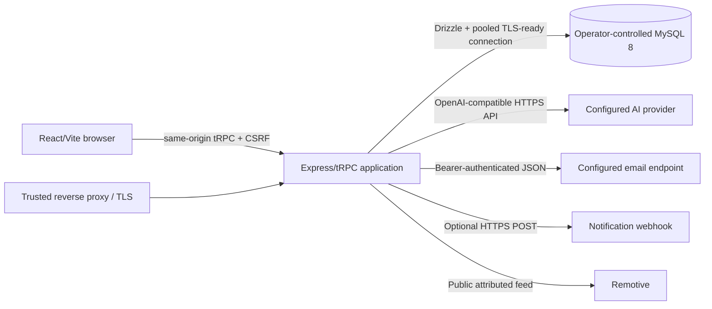

# Independence verification

## Architecture



No browser code receives database, AI, email, or webhook credentials. MySQL is
the authority for users, credentials, sessions, profiles, skills, roadmap
state, achievements, assessments, and reset-token state. No current feature
requires object storage.

## Removed runtime dependencies

| Original dependency                                  | Independent result                                                                                                        |
| ---------------------------------------------------- | ------------------------------------------------------------------------------------------------------------------------- |
| Hosted OAuth SDK/callback/JWT preview bearer path    | Local email/password credentials, opaque database sessions, explicit legacy linking                                       |
| Forge chat endpoint                                  | Server-side OpenAI-compatible provider abstraction for the active mentor feature                                          |
| Forge image/transcription/storage endpoints          | Removed after reachability tracing and database inspection proved no active feature or persisted file reference used them |
| Forge notification RPC                               | Optional generic HTTPS webhook                                                                                            |
| Hosted map/data API/heartbeat wrappers               | Removed after import/reachability tracing                                                                                 |
| Manus Vite runtime/debug collector/template metadata | Removed from code, build, package, lockfile, and HTML                                                                     |
| Injected analytics placeholders                      | Removed                                                                                                                   |

The `/storage/*` and `/manus-storage/*` compatibility routes were removed after
a read-only scan found zero live database references and frontend tracing found
zero callers.

## Verification commands

```powershell
rg -n -i "manus|forge|oauth|vite-plugin-manus|built_in_forge|webdev" . -g "!node_modules/**" -g "!.git/**"
rg -n "VITE_|process\.env|import\.meta\.env" client server shared scripts -g "*.ts" -g "*.tsx"
pnpm install --frozen-lockfile
pnpm config:check
pnpm check
pnpm test
pnpm build
pnpm audit --audit-level high
```

Classify documentation/history references separately from executable imports.
Inspect `pnpm-lock.yaml`, built `dist`, browser network calls, container
environment, and deployed secrets. A production independence claim additionally
requires staging proof that login, recovery, AI, notifications, and
opportunities operate with only independently controlled credentials, plus
confirmation that no removed storage endpoint is requested.

## Expected external services

MySQL, the selected AI/email/webhook providers, DNS/TLS/reverse proxy, and
Remotive are explicit and replaceable or optional. S3, R2, MinIO, and other
object stores are not required. Google Fonts remain a browser asset dependency;
self-host them if network independence or a stricter CSP is required. No claim
is made that Uptrail has zero external services—only that none requires the
original hosted runtime or its credentials.
