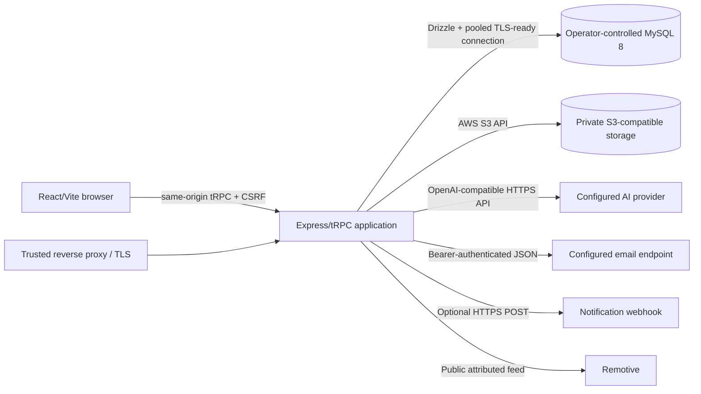

# Independence verification

## Architecture



No browser code receives the database, AI, email, webhook, or S3 credentials. MySQL is the authority for users, credentials, sessions, profiles, skills, roadmap state, achievements, and reset-token state.

## Removed runtime dependencies

| Original dependency | Independent result |
|---|---|
| Hosted OAuth SDK/callback/JWT preview bearer path | Local email/password credentials, opaque database sessions, explicit legacy linking |
| Forge chat/image/transcription endpoints | Server-side OpenAI-compatible provider abstraction |
| Forge storage presign/proxy | Direct server-side S3-compatible client and authenticated signed downloads |
| Forge notification RPC | Optional generic HTTPS webhook |
| Hosted map/data API/heartbeat wrappers | Removed after import/reachability tracing |
| Manus Vite runtime/debug collector/template metadata | Removed from code, build, package, lockfile, and HTML |
| Injected analytics placeholders | Removed |

The only intentional old name is the temporary authenticated, read-only `/manus-storage/*` route. It resolves objects from the new bucket so persisted URLs do not break. Removal requires separate approval after URL rewriting, monitoring, and retention completion.

## Verification commands

```powershell
rg -n -i "manus|forge|oauth|vite-plugin-manus|built_in_forge|webdev" . -g "!node_modules/**" -g "!.git/**"
rg -n "VITE_|process\.env|import\.meta\.env" client server shared scripts -g "*.ts" -g "*.tsx"
pnpm install --frozen-lockfile
pnpm config:check
pnpm check
pnpm test
pnpm build
pnpm audit --audit-level high
```

Classify documentation/history references separately from executable imports. Inspect `pnpm-lock.yaml`, built `dist`, browser network calls, container environment, and deployed secrets. A production independence claim additionally requires staging proof that login, recovery, AI, storage, notifications, and opportunities operate with only independently controlled credentials.

## Expected external services

MySQL, S3-compatible storage, the selected AI/email/webhook providers, DNS/TLS/reverse proxy, and Remotive are explicit and replaceable or optional. Google Fonts remain a browser asset dependency; self-host them if network independence or a stricter CSP is required. No claim is made that Uptrail has zero external services—only that none requires the original hosted runtime or its credentials.
